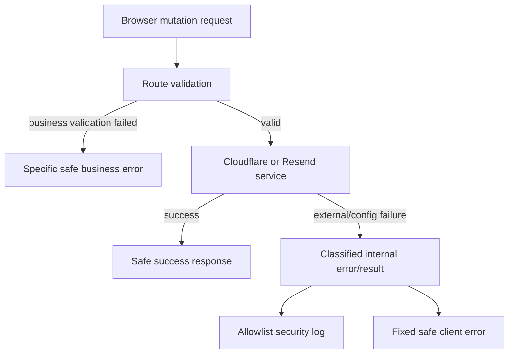

# DNS 与邮件外部服务错误响应脱敏设计

日期：2026-07-16
状态：已批准方案 B，待书面规格批准

## 1. 背景与问题

当前项目在 DNS 记录管理和邮件测试路径中会调用外部服务：Cloudflare DNS API 与 Resend API。这些外部服务返回的错误消息、响应体、状态细节或本项目内部组装的错误消息，会在部分浏览器可见响应中原样透出。

已定位的主要风险面包括：

1. `src/routes/dns.tsx` 的 `POST /api/create-dns` 和 `POST /api/dns/:id/update` 在 catch 中直接返回 `err.message`。
2. `src/routes/dns.tsx` 在 DNS 配置缺失时向普通用户返回 `DOMAINS`、`CLOUDFLARE_API_TOKEN` 等内部配置名和根域名组合细节。
3. `src/routes/dns.tsx` 的 `POST /api/dns/:id/delete` 直接调用 `deleteRecordAndCloudflare`，外部服务异常没有统一安全 JSON 响应边界。
4. `src/routes/admin.ts` 的管理员删除用户、删除 DNS 记录路径会调用 `deleteRecordAndCloudflare`，外部服务异常没有统一安全响应边界。
5. `src/routes/admin.ts` 的 `POST /api/admin/mail/test` 会在失败时返回 `sendTestEmail` 的 `result.message`，catch 时返回 `err.message`，成功时还会把收件邮箱拼入响应消息。
6. `src/services/cloudflare-dns.ts` 会把 Cloudflare HTTP 状态和错误文本拼入 Error message。
7. `src/services/mailer.ts` 会把 Resend HTTP 状态、第三方响应体片段、发件邮箱、网络异常 message 拼入返回给路由的 message。

这些行为不一定泄露 API token 本身，但会扩大信息暴露面：部署配置名、根域名与 token 映射规则、第三方错误体、发件邮箱、收件邮箱、外部服务状态细节、内部异常 message 都不应作为面向浏览器的默认错误响应。

## 2. 目标

本整改项采用方案 B：统一安全客户端响应 + allowlist 安全日志。目标如下：

1. DNS 创建、更新、删除，以及管理员触发的 DNS 删除失败时，客户端不再收到 Cloudflare 原始错误、内部异常 message、配置变量名、token 映射细节或第三方响应体。
2. 邮件测试失败时，客户端不再收到 Resend 原始错误、第三方响应体、发件邮箱、收件邮箱、内部异常 message 或原始网络错误。
3. 邮件测试成功响应不再回显收件邮箱；只返回固定成功文案。
4. 后端仍保留可运维的安全日志，但日志只允许记录 allowlist 字段，不记录请求体、邮箱、token、Cookie、IP、UA、原始异常对象或堆栈。
5. 服务层可以继续保留内部错误分类和外部 HTTP 状态用于程序判断，但路由层向浏览器输出前必须映射为固定安全文案。
6. 现有 DNS 记录创建、更新、删除、管理员删除记录/用户、邮件测试功能的正常路径不回归。
7. Better Auth 依赖版本保持精确锁定：`better-auth: 1.6.23`，`@better-auth/passkey: 1.6.23`。

## 3. 非目标

本整改项不包括：

- 修改 Cloudflare 或 Resend 的账号配置方式。
- 加密或迁移已有配置、API key、OAuth secret 或数据库 schema。
- 重做 DNS 管理或邮件设置 UI。
- 修改 DNS 记录业务规则、端口校验、子域名校验、记录数量限制或 Cloudflare API 调用语义。
- 修改邮件模板内容，除非是为了避免响应回显收件邮箱。
- 引入外部日志平台、追踪系统或告警系统。
- 处理 OAuth、首次初始化、Better Auth 登录注册路径中已经单独整改或计划单独整改的错误响应问题。

## 4. 采用方案

采用方案 B：在外部服务边界建立“内部错误可分类、客户端响应固定、安全日志 allowlist”的模式。

核心原则：

- **客户端响应**只表达用户下一步能做什么，不展示外部服务原文或内部配置细节。
- **服务层错误**可以包含程序可读分类，例如服务名、阶段、HTTP 状态、是否可重试，但不得要求路由直接暴露 `message`。
- **安全日志**只记录 allowlist 字段，供运维排查使用；日志不是把原始异常对象换个地方泄露。

## 5. DNS 错误处理设计

### 5.1 固定客户端响应

DNS 外部服务或内部配置失败时，面向浏览器的响应使用固定文案：

- Cloudflare / DNS 外部服务调用失败：`DNS 服务暂时不可用，请稍后重试`
- DNS 后端配置不可用：`DNS 配置暂不可用，请联系管理员`
- 通用 DNS 处理失败：`DNS 请求处理失败，请稍后重试`

允许继续返回的业务校验错误包括：

- 未登录、CSRF 拒绝、无权操作。
- 子域名格式、目标地址、端口、CNAME 自指等用户输入校验错误。
- 记录不存在、记录已被占用、记录数量达到上限。

这些业务错误可以包含用户已经提交或页面已经展示的域名/记录名，但不得包含 Cloudflare 原始错误体、token 配置名或内部异常 message。

### 5.2 覆盖路由

需要建立安全响应边界的 DNS 路由包括：

- `POST /api/create-dns`
- `POST /api/dns/:id/update`
- `POST /api/dns/:id/delete`
- `POST /api/admin/records/:id/delete`
- `POST /api/admin/users/:id/delete` 中逐条清理用户 DNS 记录的 Cloudflare 删除步骤

### 5.3 服务层错误分类

`src/services/cloudflare-dns.ts` 可以新增轻量错误类型或分类辅助，例如：

- `service: 'cloudflare_dns'`
- `code: 'CLOUDFLARE_REQUEST_FAILED' | 'CLOUDFLARE_ZONE_NOT_FOUND' | 'DNS_CONFIG_MISSING' | 'DNS_EXTERNAL_FAILURE'`
- `stage: 'zone_lookup' | 'record_lookup' | 'record_create' | 'record_update' | 'record_delete' | 'cleanup'`
- `status?: number`
- `retriable?: boolean`

该分类用于路由选择固定文案和写安全日志，不得被直接序列化给客户端。

### 5.4 DNS 安全日志

新增或复用安全事件序列化函数，建议事件名：`dns_external_service_failed`。

允许字段：

- `event`
- `code`
- `stage`
- `service`
- `status`
- `retriable`
- `timestamp`

禁止字段：

- Cloudflare API token 或任何 secret。
- `DOMAINS` 原始配置值、`${rootDomain}_CLOUDFLARE_API_TOKEN` 这类配置 key。
- 请求体、Cookie、Authorization header、IP、User-Agent。
- 用户邮箱、用户名。
- 原始异常对象、stack trace、第三方响应体。

## 6. 邮件测试错误处理设计

### 6.1 固定客户端响应

`POST /api/admin/mail/test` 的响应规则：

- 成功：返回固定消息 `测试邮件已提交发送`，不拼接收件邮箱。
- 邮件配置缺失：返回固定消息 `邮件配置暂不可用，请检查后台配置`。
- Resend 或网络失败：返回固定消息 `测试邮件发送失败，请检查邮件配置后重试`。
- 输入邮箱格式无效：继续返回 `请输入有效的接收邮箱`。
- 未授权：继续返回 `无权限`。

### 6.2 服务层返回结构

`src/services/mailer.ts` 可以把发送结果从自由文本 message 调整为可分类结构，例如：

- `ok: boolean`
- `code?: 'MAIL_CONFIG_MISSING' | 'MAIL_DISABLED' | 'MAIL_INVALID_RECIPIENT' | 'RESEND_REQUEST_FAILED' | 'MAIL_NETWORK_FAILURE' | 'MAIL_ALL_ACCOUNTS_FAILED'`
- `status?: number`
- `retriable?: boolean`

如果为兼容现有调用仍保留 `message`，则路由不得把该 message 直接返回给浏览器；message 只允许作为内部调试信息存在，并且不得包含第三方响应体或邮箱。

### 6.3 邮件安全日志

建议事件名：`mail_external_service_failed`。

允许字段：

- `event`
- `code`
- `stage`
- `service`
- `status`
- `account_index`
- `retriable`
- `timestamp`

禁止字段：

- Resend API key。
- 发件邮箱、收件邮箱。
- 邮件主题、HTML、验证码、模板内容。
- 请求体、Cookie、Authorization header、IP、User-Agent。
- 原始异常对象、stack trace、第三方响应体。

## 7. 错误边界与数据流

整改后的数据流应为：

关键要求：

- 路由层不得再使用 `err instanceof Error ? err.message : ...` 作为浏览器响应。
- 路由层不得把 `sendTestEmail` 或 `sendResendEmail` 的自由文本 message 原样返回给浏览器。
- 服务层不得把第三方响应体、邮箱、API key 或请求内容拼入会被路由转发的 message。
- 清理/回滚路径失败也必须走安全日志，不得因为 cleanup 失败而泄露原始外部错误。

## 8. 测试要求

至少新增或更新以下测试：

1. DNS 创建：模拟 Cloudflare 返回包含敏感文本的错误，断言 `/api/create-dns` 响应不包含 Cloudflare 原文、token 配置名、根域名 token key 或原始异常 message，只包含固定安全文案。
2. DNS 更新：模拟 Cloudflare 更新失败，断言 `/api/dns/:id/update` 响应脱敏。
3. DNS 删除：模拟 Cloudflare 删除失败，断言 `/api/dns/:id/delete` 或对应管理员删除路径响应脱敏。
4. DNS 配置缺失：断言客户端不再收到 `DOMAINS`、`CLOUDFLARE_API_TOKEN` 或具体 token key 组合细节。
5. 邮件测试失败：模拟 Resend 返回包含邮箱、API 错误体或任意敏感文本的响应，断言 `/api/admin/mail/test` 响应不包含这些文本，只包含固定安全文案。
6. 邮件测试成功：断言响应不回显收件邮箱，只返回固定成功文案。
7. 安全日志：捕获 `console.error`，断言 DNS/邮件安全事件只包含 allowlist 字段，不包含邮箱、token、请求体、Cookie、IP、UA、原始异常对象、stack trace 或第三方响应体。
8. 正常路径回归：DNS 创建/更新/删除和邮件测试成功路径仍可工作。

## 9. 验收标准

整改项 4 只有在以下条件全部满足后才算完成：

- 所有浏览器可见 DNS 外部服务失败响应不包含 Cloudflare 原始错误、第三方响应体、内部异常 message、配置变量名或 token 映射细节。
- 所有浏览器可见邮件测试失败响应不包含 Resend 原始错误、第三方响应体、发件邮箱、收件邮箱或内部异常 message。
- 邮件测试成功响应不回显收件邮箱。
- DNS 与邮件外部服务失败会产生 allowlist 安全日志，且日志字段符合本规格。
- 业务校验错误与正常成功路径不回归。
- 新增/更新测试覆盖 DNS 创建、更新、删除、配置缺失、邮件失败、邮件成功和安全日志 allowlist。
- `pnpm test` 通过。
- `pnpm exec tsc --noEmit` 通过。
- `git diff --check` 通过。
- Better Auth 依赖版本仍精确为 `1.6.23`。
- 隐私搜索确认生产响应路径不再直接返回 `err.message`、Cloudflare/Resend 原始错误体、邮箱或配置 key 细节。
